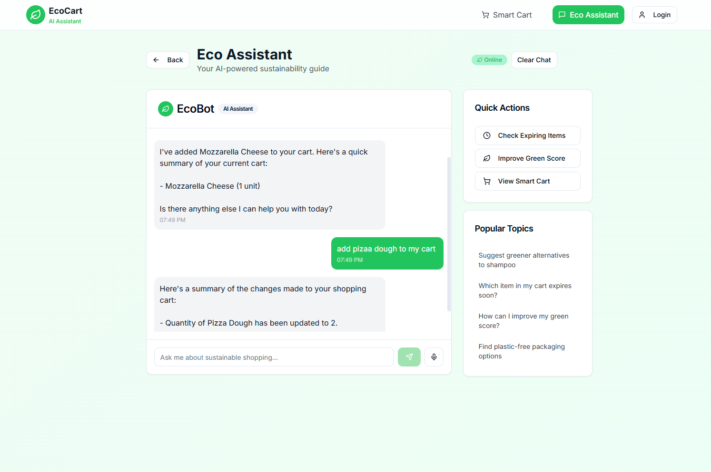
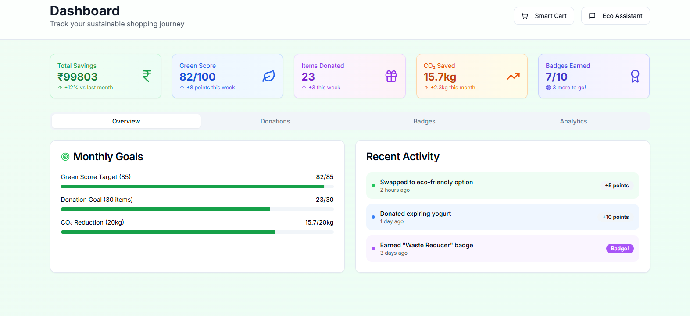
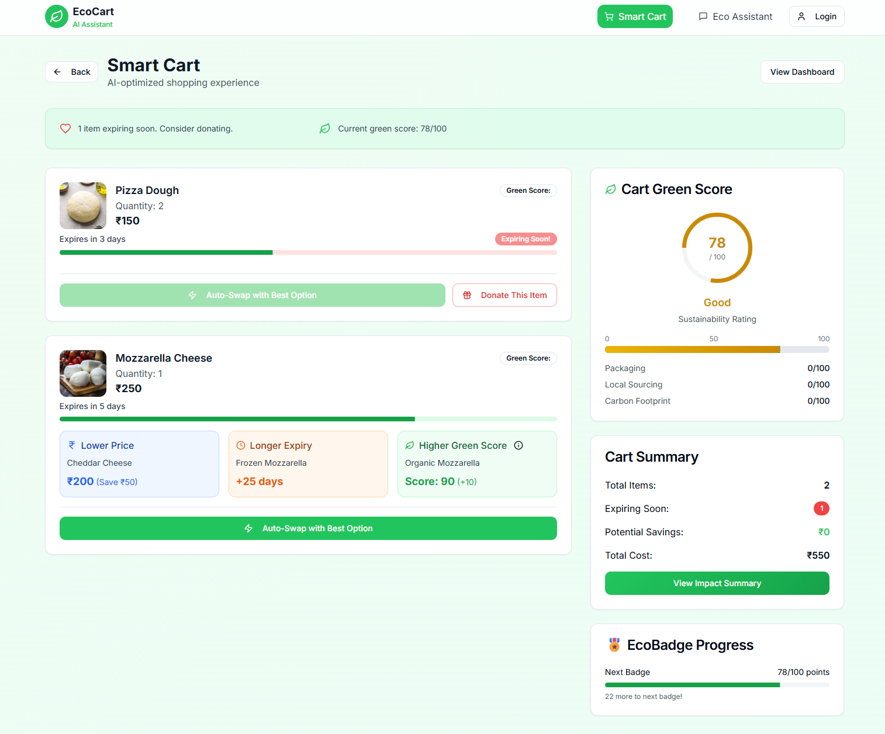

Absolutely! Here's a **comprehensive, professional `README.md`** for your project that includes everything: frontend (React), backend (FastAPI via Uvicorn), AI features, setup steps, tech stack, screenshots, and contribution info.

---

# 🌿 EcoBot — Your Smart Eco-Friendly Shopping Assistant 🛒💬

**EcoBot** is an AI-powered smart shopping assistant that helps users build environmentally friendly carts while saving money and reducing waste. Whether you're adding groceries, planning a meal, or exploring better alternatives, EcoBot has your back with intelligent suggestions and a delightful chat interface.

---

## 🚩 What is EcoBot?

EcoBot allows users to:

- 🧠 **Interact with an AI assistant** to manage shopping carts via natural language (e.g. “Add mozzarella cheese”).
- 🍃 **Automatically find green alternatives** for products.
- 💰 **Compare prices** and get smart swap suggestions to save more.
- ⏳ **Receive expiry alerts** to minimize food waste.
- 🥘 **Add dishes** and automatically populate ingredients.
- 📦 **Get visual summaries** of their cart with impact scores.

---

## 🔧 Tech Stack

| Layer         | Technology                             |
| ------------- | -------------------------------------- |
| **Frontend**  | React, Tailwind CSS                    |
| **Backend**   | FastAPI (served with Uvicorn), SQLite  |
| **AI/Logic**  | LangGraph (LangChain), Groq LLaMA 3.1  |
| **Database**  | SQLModel ORM + SQLite                  |
| **Chat Flow** | LangGraph State Machine + Tool Routing |

---

## 📁 Project Structure

```
ecobot/
├── server/
│   ├── server.py            # FastAPI backend with LangGraph agent
│   ├── cart.db              # SQLite database
│
├── client/
│   ├── src/
│   │   └── components/      # React UI components
│   ├── public/
│   └── ...
├── README.md
└── ...
```

---

## ⚙️ Features

### ✅ Cart Management with AI

- Natural language interface to **add/remove items** from the cart.
- AI automatically parses user intent and modifies the cart accordingly.

### 🥦 Smart Suggestions

- AI suggests **eco-friendlier products** using `green_score` and `expiry_days`.
- Cost-saving **alternatives** are shown when available.

### 📈 Eco Impact Dashboard

- View **expiry alerts**, **green alternatives**, and **impact scores** visually.
- Helps reduce carbon footprint and avoid food waste.

### 🧑‍🍳 Ingredient Planner

- Ask for dishes (e.g., “Make pizza”) and let EcoBot **fetch ingredients**.
- Add everything to your cart in one go.

---

Here's the modified section of your README that **displays all images normally in a vertical list**, without using a table format:

---


## 🧪 Screenshots

### 🛒 Cart Overview






---

## 🚀 Getting Started

### Prerequisites

- Python 3.10+
- Node.js 18+
- pip / npm

---

### 1️⃣ Backend Setup

#### Install Python packages

```bash
cd server
python -m venv env
source env/bin/activate   # On Windows: env\Scripts\activate
pip install -r requirements.txt
```

#### Run the Uvicorn FastAPI server

```bash
uvicorn server:app --reload
```

By default, it runs at:
👉 `http://localhost:8000`

---

### 2️⃣ Frontend Setup

```bash
cd client
npm install
npm run dev
```

Your React app will run at:
👉 `http://localhost:8081`

---

### Optional: Seed Initial Products

Call the seed route (once):

```bash
curl -X POST http://localhost:8000/seed-products
```

---

## 📬 API Endpoints (Backend)

| Method | Endpoint          | Description                        |
| ------ | ----------------- | ---------------------------------- |
| POST   | `/agent`          | Main chat handler (with LangGraph) |
| GET    | `/cart`           | Get current cart items             |
| POST   | `/cart/add`       | Add an item to the cart            |
| DELETE | `/cart/{item_id}` | Delete a cart item                 |
| PATCH  | `/cart/update`    | Update quantity                    |
| POST   | `/cart/swap`      | Swap an item with an alternative   |
| POST   | `/seed-products`  | Seed initial product list          |

---

## 🤖 AI Assistant Capabilities

- Uses **LangGraph** to manage state transitions (intent → tool → summary).
- LLM: **Groq's LLaMA 3.1 8B** for blazing-fast reasoning.
- Tools include:

  - `search_and_add`
  - `search_and_delete`
  - `describe_cart`
  - `web_search_ingredients`
  - `update_quantity`

---

## 💡 Use Case Highlights

- **Sustainable Shoppers**: Get eco scores and local swaps.
- **Busy Parents**: Just say "Add ingredients for lasagna"—done.
- **Budget-Conscious Buyers**: Smart swaps save you ₹₹.
- **Environment Advocates**: Track footprint, expiry, and more.

---

## ✨ Upcoming Features

- 🌐 Google Shopping / Walmart integration
- 🎙️ Voice assistant with Web Speech API
- 📊 Personalized green footprint dashboard
- 🧾 PDF/exportable green cart summary

---

## 🛠️ Contributing

We welcome PRs, suggestions, and feedback!
Open an issue or fork and raise a pull request 🙌

---

## 📄 License

MIT License

---

## 🙌 Acknowledgements

- [LangGraph](https://www.langchain.dev/langgraph/)
- [Groq](https://groq.com/)
- [FastAPI](https://fastapi.tiangolo.com/)
- [React](https://reactjs.org/)
- [Tailwind CSS](https://tailwindcss.com/)
